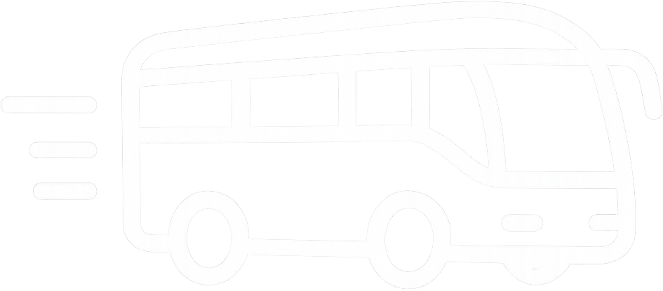
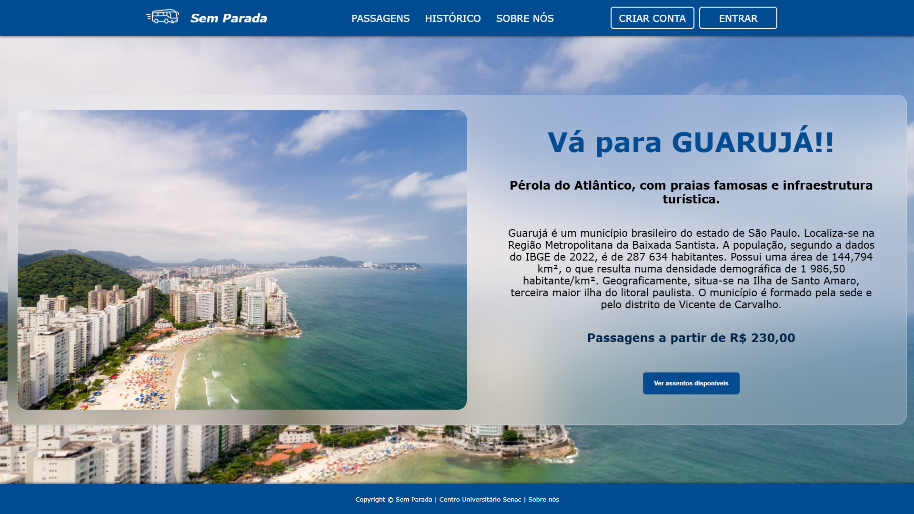
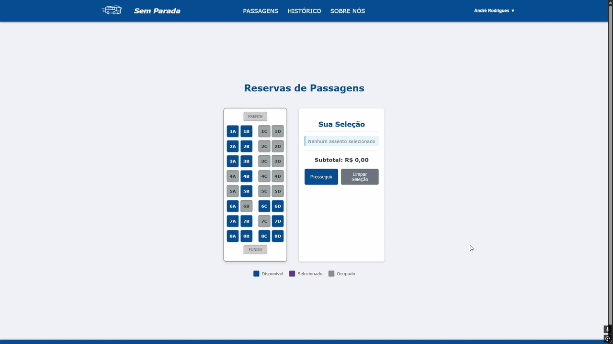
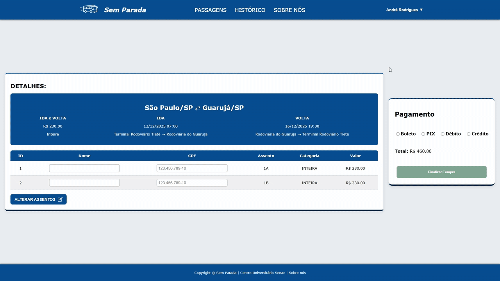
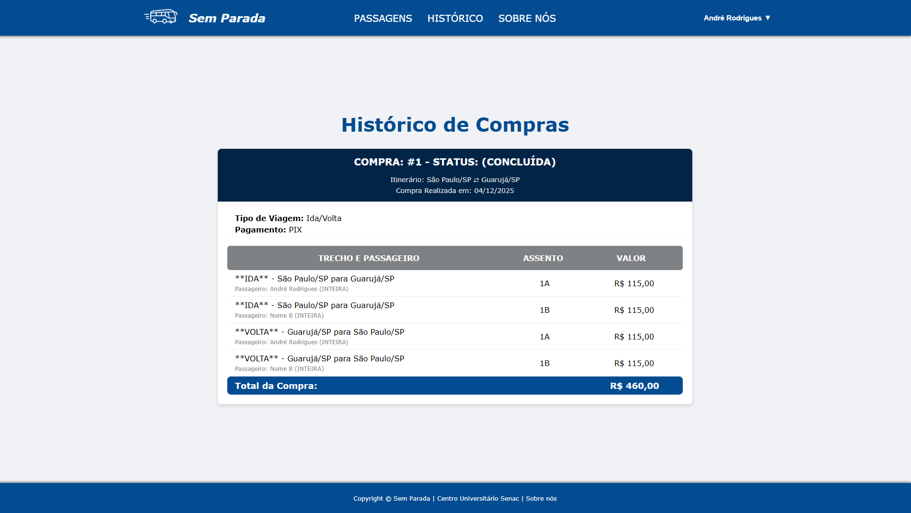
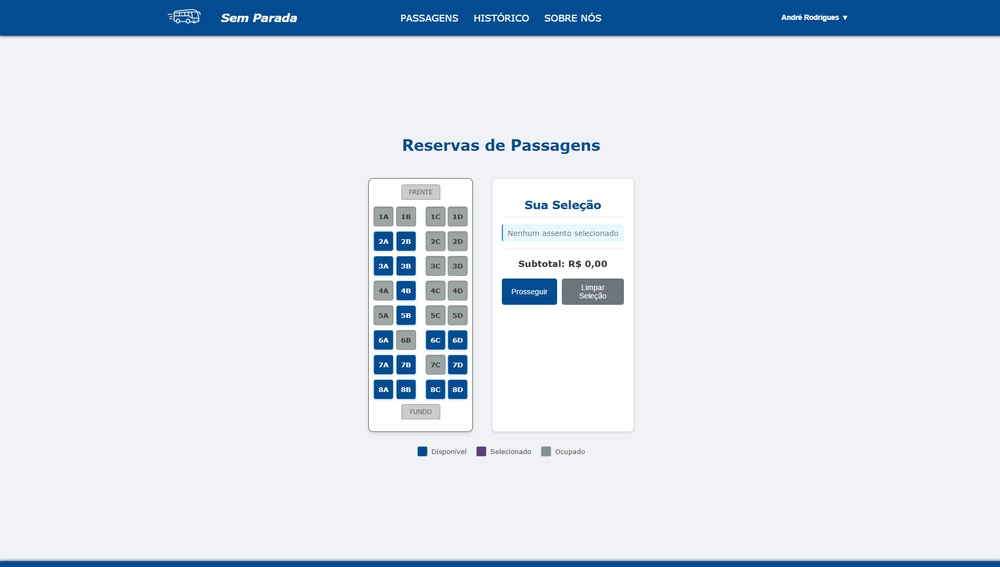

# Projeto – Sem Parada .....

Aplicação web desenvolvida em grupo como requisito da disciplina de <b>Programação Web</b> do curso de <b>TADS – Senac.</b>

## Integrantes:

- André Rodrigues
- André Coutinho
- Fernanda Souza
- João Caetano
- Willian Wallace

## Visão Geral

O <b>Sem Parada</b> é uma aplicação web que simula o sistema de uma empresa de viagens rodoviárias.
O desafio era criar tudo na unha: apenas <b>HTML, CSS, JavaScript puro e LocalStorage</b> — sem frameworks, sem bibliotecas externas.

## Principais Recursos Desenvolvidos:

- <b>Autenticação completa</b>

  - Cadastro
  - Login
  - Persistência local de dados
     

- <b>Reserva de passagens</b>

  - Seleção de ofertas
  - Escolha de destinos
     

- <b>Validação de dados</b>

  - Nome
  - CPF
  - Email
  - Senha
     

- <b>Sistema de seleção de assentos</b>

  - Assentos ocupados
  - Assentos disponíveis
  - Assentos já escolhidos pelo usuário
     

- <b>Histórico de compras por usuário</b>
  - Totalmente vinculado aos dados salvos no navegador
  - Atualizado a cada reserva

## Resumo

O projeto entrega uma experiência funcional simulando um sistema real de compra de passagens, demonstrando domínio dos fundamentos da Web sem apoio de tecnologias adicionais. O foco foi provar entendimento de <b>fluxo de dados, validação, manipulação de DOM, usabilidade e persistência local</b>.

## 📸 Exemplos Visuais

Veja algumas das telas desenvolvidas:

### 📝 Tela de Cadastro & Login

  

### 🚌 Tela de Ofertas

  

---

### 🚌 Tela Exclusiva da Oferta

  

---

### 🎫 Seleção de Assentos

  

---

### 💳 Pagamento / Finalização

  

---

### 🧾 Histórico de Compras

  

---

### 🎫 Seleção de Assentos (Após finalizar reserva)

  

