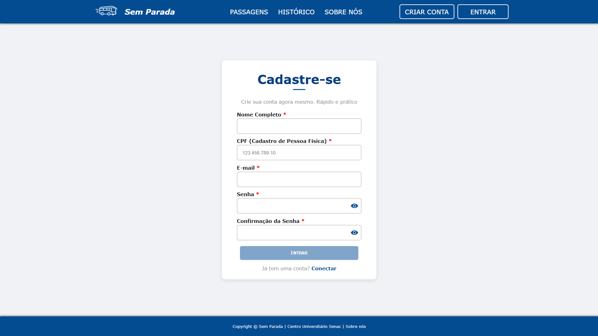
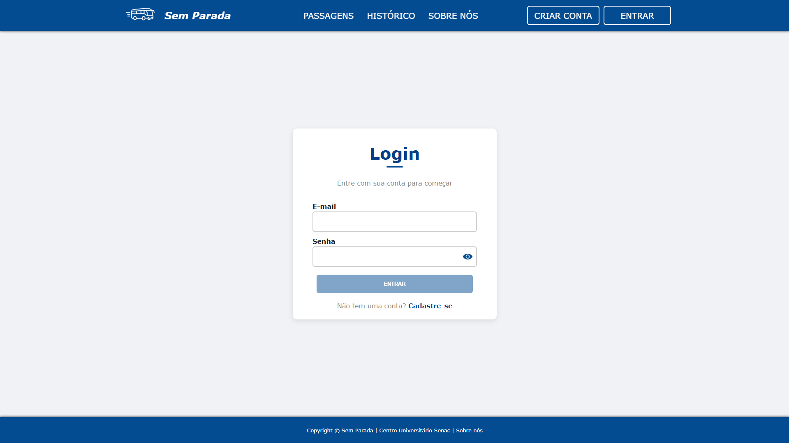
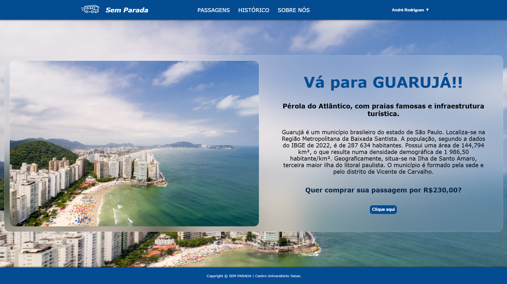
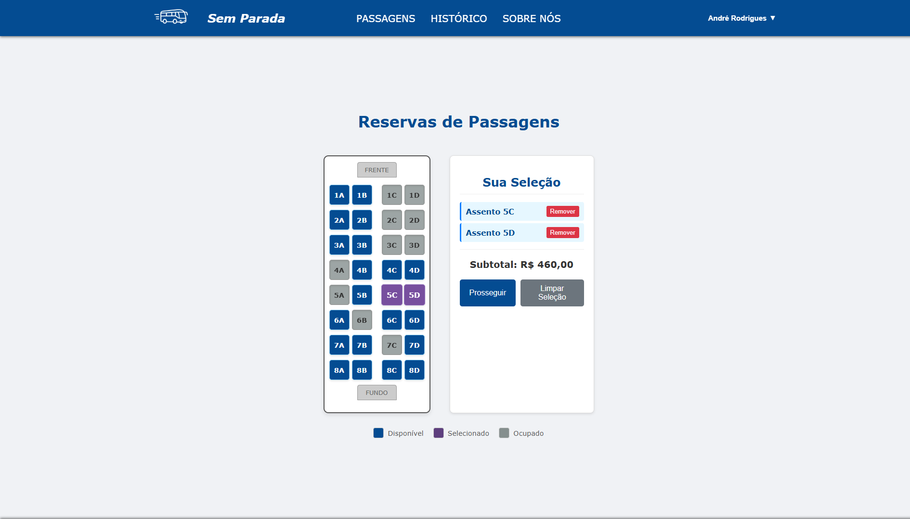
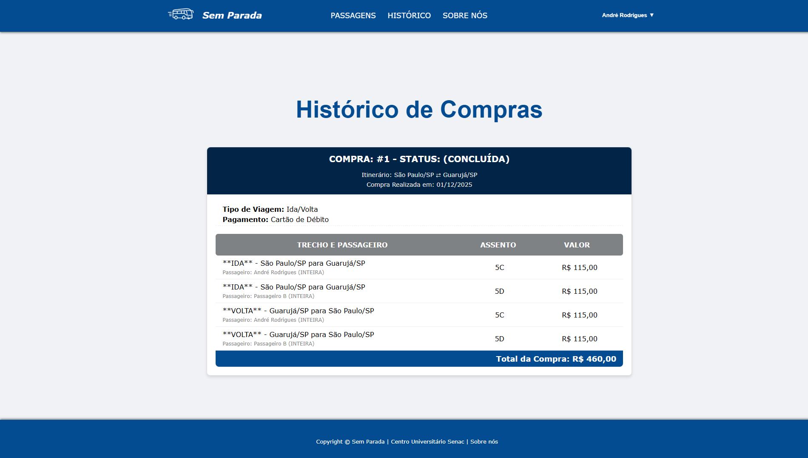
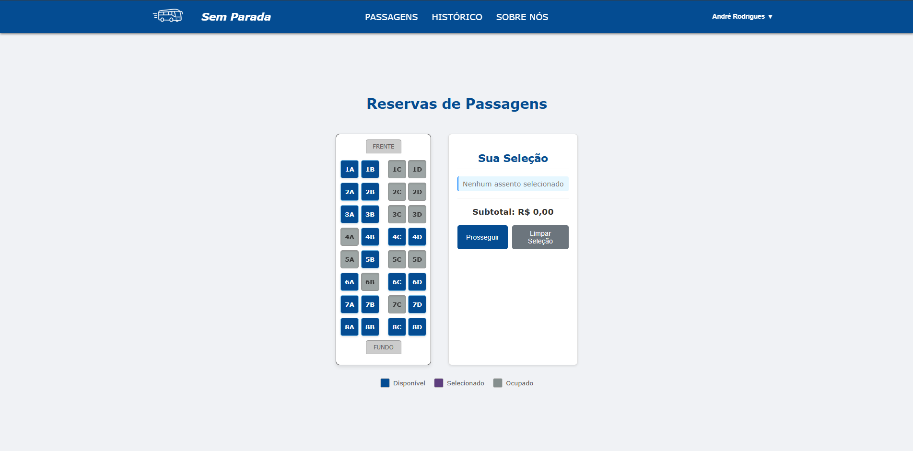

# Projeto – Sem Parada

Aplicação web desenvolvida em grupo como requisito da disciplina de Programação Web do curso de TADS – Senac.

## Integrantes:

- André Rodrigues
- André Coutinho
- Fernanda Souza
- João Caetano
- William Wallace

## Visão Geral

O Sem Parada é uma aplicação web que simula o sistema de uma empresa de viagens rodoviárias.
O desafio era criar tudo na unha: apenas HTML, CSS, JavaScript puro e LocalStorage — sem frameworks, sem bibliotecas externas, sem atalhos.

## Principais Recursos Desenvolvidos:

- Autenticação completa

  - Cadastro
  - Login
  - Persistência local de dados

- Reserva de passagens

  - Seleção de ofertas
  - Escolha de datas e destinos

- Validação de dados
  - Nome
  - CPF
  - Email
  - Senha
- Sistema de seleção de assentos
  - Assentos ocupados
  - Assentos disponíveis
  - Assentos já escolhidos pelo usuário
- Histórico de compras por usuário
  - Totalmente vinculado aos dados salvos no navegador
  - Atualizado a cada reserva

## Resumo

O projeto entrega uma experiência funcional simulando um sistema real de compra de passagens, demonstrando domínio dos fundamentos da Web sem apoio de tecnologias adicionais. O foco foi provar entendimento de fluxo de dados, validação, manipulação de DOM, usabilidade e persistência local.

## 📸 Exemplos Visuais

Veja algumas das telas desenvolvidas:

### 📝 Tela de Cadastro

  

---

### 🔐 Tela de Login

  

---

### 🚌 Tela de Ofertas

  

---

### 🚌 Tela Exclusiva da Oferta

  

---

### 🎫 Seleção de Assentos

  

---

### 💳 Pagamento / Finalização

  

---

### 🧾 Histórico de Compras

  

---

### 🎫 Seleção de Assentos (Após finalizar reserva)

  

